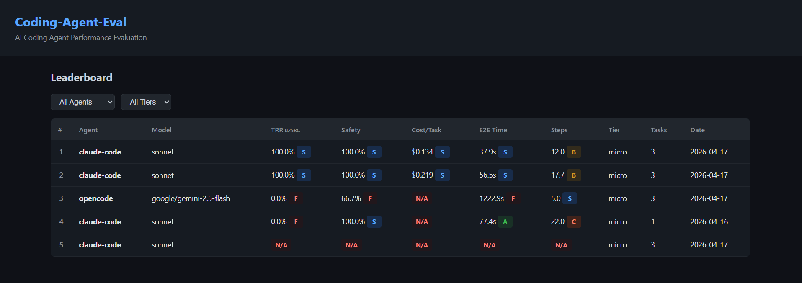

# Coding-Agent-Eval

**CLI AI Coding Agent Performance Evaluation System**

SWE-bench 데이터셋 기반으로 CLI AI 코딩 에이전트(Claude Code, Codex, OpenCode 등)의 성능을 자동 평가하고, 6개 지표에 대한 비교 리포트를 생성합니다.



## 프로젝트 구조

```
coding-agent-eval/
├── config/
│   ├── eval_config.yaml              # 티어별 설정, 실행 제한, 모델 가격표
│   ├── agents/
│   │   └── claude_code.yaml          # 에이전트별 설정
│   └── environments/
│       ├── common.yaml               # 공통 설정
│       ├── wsl.yaml                  # WSL2 환경 설정
│       └── native_linux.yaml         # 네이티브 Linux 설정
│
├── src/
│   ├── core/
│   │   ├── models.py                 # AgentResult, EvalTask, TokenUsage 등 데이터 모델
│   │   ├── config.py                 # 환경별 YAML 로드 + .env 병합
│   │   └── env_detect.py             # OS/네트워크/디스크/Docker 자동 감지
│   │
│   ├── dataset/
│   │   ├── loader.py                 # HuggingFace 온라인 / 로컬 JSONL 오프라인 로더
│   │   └── sampler.py                # Lite / Verified / Full / Multi 티어별 샘플러
│   │
│   ├── adapters/
│   │   ├── base.py                   # AgentAdapter 베이스 클래스
│   │   └── claude_code.py            # Claude Code CLI 어댑터 (claude -p)
│   │
│   ├── runner/
│   │   ├── orchestrator.py           # 태스크 실행 (중단/재개 지원)
│   │   ├── sandbox.py                # 레포 클론 + 디스크 관리
│   │   └── logger.py                 # 실행 로그 + 메타데이터 저장
│   │
│   ├── evaluator/
│   │   ├── docker_evaluator.py       # SWE-bench Docker 이미지 기반 테스트 검증
│   │   ├── swebench_harness.py       # SWE-bench 하네스 래핑 + EvalResult 모델
│   │   └── patch_extractor.py        # git diff 패치 추출/검증
│   │
│   ├── metrics/
│   │   ├── accuracy.py               # Task Resolution Rate
│   │   ├── cost.py                   # Token Efficiency, Cost per Resolved Task
│   │   ├── latency.py                # E2E Time, Time to First Action
│   │   └── process.py                # Convergence Steps
│   │
│   └── reporter/
│       ├── scorer.py                 # 지표별 등급 산출 (S/A/B/C/D/F)
│       ├── comparator.py             # 멀티 에이전트/환경 결과 병합
│       └── formatter.py              # Markdown, JSON, CSV 리포트 포맷
│
├── scripts/
│   ├── run_eval.py                   # 평가 실행 CLI
│   ├── run_docker_eval.py            # Docker 기반 테스트 검증 CLI
│   ├── generate_report.py            # 리포트 생성 CLI
│   ├── create_test_data.py           # 합성 테스트 데이터 생성
│   ├── export_dataset.py             # 오프라인용 데이터셋 내보내기
│   ├── run_e2e_test.py               # Mock 에이전트 E2E 파이프라인 테스트
│   └── setup_env.sh                  # 환경 자동 구축 스크립트
│
├── data/                             # 데이터셋 (gitignore)
│   ├── swebench_local.jsonl          # Local 티어 (로컬 전용 합성/커스텀 데이터)
│   ├── swebench_lite.jsonl           # Lite 티어 (300개)
│   ├── swebench_verified.jsonl       # Verified 티어 (500개)
│   ├── swebench_full.jsonl           # Full 티어 (2,294개)
│   └── swebench_multi.jsonl          # Multi(Multilingual) 티어 (300개)
│
├── results/                          # 실행 결과 (gitignore)
│   └── runs/{run_id}/
│       ├── {agent_name}/*.json       # 태스크별 에이전트 결과
│       ├── eval/*.json               # Docker 테스트 검증 결과
│       ├── metadata.json             # 실행 메타데이터
│       └── report_*.{md,json,csv}    # 리포트
│
├── pyproject.toml
└── .env.example                      # API 키 템플릿
```

## 평가 워크플로우

전체 파이프라인은 3단계로 구성됩니다:

```
Step 1: 에이전트 실행        Step 2: 테스트 검증           Step 3: 리포트 생성
(run_eval.py)               (run_docker_eval.py)         (generate_report.py)

 데이터셋 로드                SWE-bench Docker 이미지       결과 로드
      │                      pull (per-instance)              │
 티어별 샘플링                      │                     6개 지표 계산
      │                      컨테이너 시작                     │
 레포 클론 +                  (/testbed에 환경 세팅됨)      등급 산출 (S~F)
 base_commit checkout              │                          │
      │                      test_patch 적용              비교 리포트 생성
 에이전트 실행                      │                    (Markdown/JSON/CSV)
 (claude -p ...)             agent patch 적용
      │                            │
 git diff → 패치 추출         FAIL_TO_PASS 테스트 실행
      │                      (버그 수정 검증)
 결과 저장                          │
 (토큰, 비용, 시간)          PASS_TO_PASS 테스트 실행
                              (회귀 검증)
                                    │
                              검증 결과 저장
```

### 내부 동작 상세

이 파이프라인이 어떻게 동작하는지 처음부터 끝까지 따라가 봅니다.

**Step 1에서 에이전트는 어떻게 코드를 수정하는가?**

에이전트 어댑터(`src/adapters/claude_code.py`)는 Anthropic API를 직접 호출하지 않습니다. Claude Code CLI 바이너리를 `subprocess.run`으로 실행합니다:

```python
cmd = [
    "claude", "-p", problem_statement,
    "--output-format", "json",
    "--max-budget-usd", str(self.max_budget),
    "--allowedTools", "Bash,Read,Write,Edit",
    "--dangerously-skip-permissions",
]

proc = subprocess.run(cmd, cwd=repo_path, ...)
```

`-p` 플래그는 Claude Code를 비대화(print) 모드로 실행합니다. `cwd=repo_path`로 클론된 레포 디렉토리 안에서 실행되므로, Claude Code는 해당 프로젝트의 코드를 직접 읽고 Edit/Write 도구로 파일을 수정합니다. `--output-format json`으로 실행 결과(토큰 사용량, 비용, 턴 수 등)가 JSON으로 stdout에 출력됩니다.

**프롬프트는 별도로 작성하지 않습니다.** SWE-bench 데이터셋의 `problem_statement` 필드 — GitHub 이슈 내용 그대로 — 를 `-p` 인자로 전달합니다. 예를 들어 `"FileInput shouldn't display required attribute when initial data exists."`와 같은 이슈 설명이 곧 프롬프트입니다. "패치를 만들어라"거나 "이 형식으로 답변하라"는 지시는 없습니다.

**결과물은 Claude Code의 텍스트 응답이 아닙니다.** Claude Code가 파일을 수정하면 git working tree에 변경이 남습니다. 실행이 끝난 후 `_extract_patch()` (`src/adapters/base.py`)가 `git diff`를 실행하여 변경분을 patch로 추출합니다. 이 patch가 에이전트의 "답안"이 됩니다.

**Step 1만으로는 정확도를 검증할 수 없습니다.** Step 1의 결과는 에이전트가 patch를 생성했는지 여부, 소요 시간, 토큰 사용량, 비용 등의 실측 데이터뿐입니다. patch가 실제로 버그를 수정하는지는 이 단계에서 알 수 없습니다 — Step 1의 환경은 호스트 머신의 임시 디렉토리에 소스코드만 클론한 것이므로, 프로젝트의 의존성이 설치되어 있지 않아 테스트를 실행할 수 없습니다. 임시 디렉토리는 patch 추출 후 삭제됩니다.

**그래서 Step 2가 필요합니다.** SWE-bench는 인스턴스별로 정확한 개발환경이 세팅된 Docker 이미지(`ghcr.io/epoch-research/swe-bench.eval.x86_64.{instance_id}:latest`)를 제공합니다. 이 이미지 안에는 해당 프로젝트의 정확한 Python 버전, 모든 의존성, conda 환경이 `/testbed` 디렉토리에 사전 설치되어 있습니다. Step 2에서는 이 Docker 컨테이너를 시작하고, Step 1에서 저장해둔 patch를 `/testbed`에 적용한 뒤 FAIL_TO_PASS와 PASS_TO_PASS 테스트를 실행합니다. **두 테스트 카테고리가 모두 통과**해야 해당 태스크는 `resolved`로 인정됩니다 — F2P가 통과하면 버그가 실제 수정됐고, P2P가 유지되면 기존 기능에 회귀가 없는 것입니다.

**patch는 두 환경을 잇는 전달체입니다.** 에이전트가 코드를 수정한 환경(호스트 임시 디렉토리)과 테스트를 실행하는 환경(SWE-bench Docker 컨테이너)이 완전히 분리되어 있기 때문에, patch라는 이식 가능한 형태로 변경분을 전달합니다. 이것은 SWE-bench 벤치마크의 표준 방식이기도 합니다 — 500개 인스턴스가 각각 다른 프로젝트, 다른 버전, 다른 의존성을 가지고 있어 호스트에서 이를 모두 재현하는 것은 비현실적이므로, 에이전트는 patch만 제출하고 검증은 통제된 Docker 환경에서 수행합니다.

## 측정 지표 (6개)

6개 지표는 정확도, 비용, 속도, 프로세스의 네 가지 범주로 나뉩니다. 각 지표는 S/A/B/C/D/F 6단계로 등급이 매겨집니다.

### 태스크 status와 resolved 정의

지표 계산을 이해하려면 먼저 각 태스크의 평가 결과 분류를 알아야 합니다.

**태스크 `status`** — 파이프라인 전체 결과를 다음 셋 중 하나로 분류합니다:

| status | 의미 | 예시 |
|--------|------|------|
| `success` | F2P, P2P 테스트가 모두 끝까지 실행됨 (통과 여부와 무관) | 정상 평가가 완료된 모든 케이스 |
| `fail` | 에이전트 측 문제로 평가 진행 불가 | patch 미생성, patch가 적용되지 않음 |
| `error` | 환경적 문제로 평가 진행 불가 (에이전트 책임 아님) | Docker 이미지 pull 실패, 컨테이너 시작 실패, 테스트 러너 크래시 |

**태스크 `resolved`** — F2P **AND** P2P 테스트가 **모두 통과**한 경우에만 `resolved=True`. 하나라도 실패하면 `not resolved`. 이는 "버그를 수정했고 + 기존 기능을 깨뜨리지 않았다"는 두 조건을 동시에 만족해야 함을 의미합니다.

대시보드 상세 페이지 상단에 success/fail/error/resolved 카운트와 TRR 산식이 함께 표시되어 결과 해석이 직관적입니다.

### 1. Task Resolution Rate (TRR)

에이전트가 생성한 patch로 실제 버그가 해결된 비율입니다.

```
TRR = resolved 태스크 수 / (success + fail 태스크 수)
```

분모는 **`success` + `fail` 태스크 수**이며 **`error` 상태 태스크는 제외**됩니다 — 환경적 실패는 에이전트 책임이 아니므로 정확도 평가에 포함하지 않는 것이 공정합니다. 분자는 F2P와 P2P를 모두 통과한 `resolved` 태스크 수입니다. Step 2(Docker 테스트 검증)를 수행하지 않으면 모든 태스크가 stub `fail`로 처리되어 TRR=0%로 표시되며, 실제 평가가 아닌 "테스트가 실행되지 않음"을 의미합니다.

| 등급 | S | A | B | C | D | F |
|------|---|---|---|---|---|---|
| 기준 | >= 60% | >= 45% | >= 30% | >= 20% | >= 10% | < 10% |

### 2. Token Efficiency

해결된 태스크당 평균 토큰 사용량입니다. 낮을수록 좋습니다.

```
Token Efficiency = sum(해결된 태스크의 total_tokens) / (해결된 태스크 수)
```

`total_tokens`는 `input_tokens + output_tokens`이며, input_tokens에는 cache read/write 토큰이 포함됩니다. Claude Code의 JSON 출력에서 `usage.input_tokens`, `usage.cache_read_input_tokens`, `usage.cache_creation_input_tokens`, `usage.output_tokens`를 합산하여 계산합니다. 해결되지 않은 태스크는 계산에서 제외됩니다 — 실패한 태스크에 소비된 토큰은 효율성 측정에 노이즈가 되기 때문입니다.

| 등급 | S | A | B | C | D | F |
|------|---|---|---|---|---|---|
| 기준 | <= 50K | <= 100K | <= 200K | <= 400K | <= 800K | > 800K |

### 3. Cost per Resolved Task (CRT)

해결된 태스크당 평균 API 비용입니다. 낮을수록 좋습니다.

```
CRT = (전체 태스크의 총 비용) / (해결된 태스크 수)
```

비용은 Claude Code의 JSON 출력에 포함된 `total_cost_usd` 값을 사용합니다. 이 값이 없는 경우 `config/eval_config.yaml`의 모델별 토큰 단가표를 사용하여 토큰 수에서 역산합니다. Token Efficiency와 달리 분자에 전체 비용(실패 포함)을 사용합니다 — 실패한 시도에 들어간 비용도 실제 지출이기 때문입니다.

| 등급 | S | A | B | C | D | F |
|------|---|---|---|---|---|---|
| 기준 | <= $0.50 | <= $1.00 | <= $2.00 | <= $5.00 | <= $10.00 | > $10.00 |

### 4. E2E Completion Time

태스크당 평균 종단간 실행 시간(초)입니다. 낮을수록 좋습니다.

```
E2E Time = avg(task_end - task_start)
```

에이전트에 프롬프트를 전달한 시점(`task_start`)부터 실행이 완전히 종료된 시점(`task_end`)까지의 시간입니다. 레포 클론이나 Docker 이미지 pull 시간은 포함되지 않고, 순수하게 에이전트가 문제를 풀고 코드를 수정하는 데 걸린 시간만 측정합니다.

| 등급 | S | A | B | C | D | F |
|------|---|---|---|---|---|---|
| 기준 | <= 60s | <= 120s | <= 300s | <= 600s | <= 1200s | > 1200s |

### 5. Time to First Action (TTFA)

에이전트가 첫 번째 동작(파일 읽기, 코드 수정 등)을 수행하기까지 걸린 시간(초)입니다. 낮을수록 좋습니다.

```
TTFA = first_action - task_start
```

에이전트가 프롬프트를 받은 후 문제를 이해하고 첫 번째 도구 호출을 시작하기까지의 지연 시간을 나타냅니다. Claude Code의 JSON 출력에 `duration_api_ms`와 `num_turns`가 포함되어 있으면 `duration_api_ms / num_turns`로 추정하고, 없는 경우 전체 실행 시간의 10%로 근사합니다.

| 등급 | S | A | B | C | D | F |
|------|---|---|---|---|---|---|
| 기준 | <= 3s | <= 5s | <= 10s | <= 20s | <= 30s | > 30s |

### 6. Convergence Steps

에이전트가 태스크를 완료하기까지 수행한 평균 턴(스텝) 수입니다. 낮을수록 좋습니다.

```
Convergence Steps = avg(num_turns)
```

Claude Code의 JSON 출력에 포함된 `num_turns` 값을 사용합니다. 한 턴은 에이전트가 모델을 한 번 호출하여 응답을 받고 도구를 실행하는 단위입니다. 적은 턴으로 문제를 해결할수록 에이전트가 효율적으로 문제를 파악하고 수정한 것으로 평가됩니다. 불필요한 시행착오 없이 정확한 수정을 할수록 이 지표가 좋아집니다.

| 등급 | S | A | B | C | D | F |
|------|---|---|---|---|---|---|
| 기준 | <= 5 | <= 10 | <= 20 | <= 30 | <= 50 | > 50 |

## 설치 및 환경 구축

### 요구사항

- Python 3.10+
- Docker (테스트 검증용)
- Claude Code CLI (`claude` 명령어)

### 설치

```bash
# 1. 가상환경 생성
python3 -m venv .venv
source .venv/bin/activate

# 2. 의존성 설치
pip install -r requirements.txt
# 개발(테스트 도구 포함) 환경이라면:
# pip install -r requirements-dev.txt

# 3. (선택) 프로젝트를 editable 모드로 설치 — 어느 경로에서든 `src.*` 임포트 가능
pip install -e .

# 4. API 키 설정
cp .env.example .env
# .env 파일에 ANTHROPIC_API_KEY 입력
```

### 데이터셋 준비

```bash
# 방법 1: HuggingFace에서 다운로드 (온라인)
# → run_eval.py 실행 시 자동 다운로드됨

# 방법 2: REST API로 다운로드 (SSL 문제 시)
curl -s "https://datasets-server.huggingface.co/rows?dataset=princeton-nlp%2FSWE-bench_Verified&config=default&split=test&offset=0&length=500" \
  | python3 -c "import sys,json; rows=[r['row'] for r in json.load(sys.stdin)['rows']]; open('data/swebench_verified.jsonl','w').write('\n'.join(json.dumps(r) for r in rows))"

# 방법 3: 테스트용 합성 데이터
python scripts/create_test_data.py
```

## 실행 방법

### 1. E2E 파이프라인 테스트 (Mock 에이전트)

실제 에이전트 없이 전체 파이프라인이 동작하는지 확인합니다:

```bash
python scripts/create_test_data.py
python scripts/run_e2e_test.py
```

### 2. 전체 평가 실행 (한 번에)

`--verify` 옵션을 사용하면 에이전트 실행 → Docker 테스트 검증 → 리포트 생성까지 한 명령어로 수행됩니다:

```bash
# Claude Code (Sonnet) — 전체 평가 (run-id는 자동 생성)
python scripts/run_eval.py \
    --tier lite --agents claude-code --model sonnet \
    --sample-size 3 --verify

# OpenCode (Gemini 2.5 Flash) — 전체 평가
python scripts/run_eval.py \
    --tier lite --agents opencode --model google/gemini-2.5-flash \
    --sample-size 3 --verify
```

`--run-id`를 생략하면 `{agent}_{model}_{YYYYMMDD-HHMMSS}` 형태로 자동 생성됩니다. 직접 지정하고 싶다면 `--run-id my-eval` 식으로 넘기면 되고, 같은 id 디렉터리가 이미 있으면 저장된 진행 상황을 읽어 **이어서 실행**(resume)합니다.

`--verify` 없이 실행하면 에이전트 실행(패치 생성)만 수행되고, Docker 검증과 리포트는 별도 명령어로 나중에 실행할 수 있습니다.

### 3. 단계별 분리 실행

각 단계를 개별적으로 실행할 수도 있습니다:

```bash
# Step 1: 에이전트 실행 (패치 생성만, run-id 자동 생성)
python scripts/run_eval.py \
    --tier lite --agents claude-code --model sonnet --sample-size 3

# Step 1 실행 후 출력되는 Run ID를 Step 2/3에서 사용
# Step 2: Docker 테스트 검증
python scripts/run_docker_eval.py --run-id <run-id> --agent claude-code

# Step 3: 리포트 생성
python scripts/generate_report.py --run-id <run-id> --format markdown,json
```

이 방식은 Step 1 실행 후 결과를 확인하고 선택적으로 검증을 진행하거나, 여러 환경의 결과를 병합하여 리포트를 생성할 때 유용합니다.

```bash
# 여러 환경 결과 병합 리포트
python scripts/generate_report.py --run-id eval-merged \
    --merge-dirs results/runs/eval-external,results/runs/eval-internal
```

**run_eval.py 옵션:**

| 옵션 | 설명 | 기본값 |
|------|------|--------|
| `--tier` | 데이터셋 티어 (local/lite/verified/full/multi) | 자동 감지 |
| `--agents` | 에이전트 이름 (claude-code, opencode) | claude-code |
| `--model` | 사용할 모델 | 에이전트 기본 모델 |
| `--run-id` | 실행 식별자 (같은 id가 있으면 이어서 진행) | 자동 생성 |
| `--sample-size` | 샘플 수 오버라이드 | 티어 기본값 |
| `--verify` | Docker 검증 + 리포트까지 한번에 실행 | false |
| `--offline` | 오프라인 모드 (로컬 데이터만) | false |
| `--dry-run` | 실행 계획만 출력 | false |

`--run-id`를 생략하면 `{agent}_{model}_{YYYYMMDD-HHMMSS}` 형태로 자동 생성되며, 결과는 `results/runs/<run-id>/`에 저장됩니다. `--run-id`를 명시적으로 지정했는데 같은 id의 디렉터리가 이미 있으면 **저장된 진행 상황을 이어서 실행**합니다 (완료된 태스크는 건너뛰고, 실패/미완료 태스크만 다시 시도). 해당 id의 디렉터리가 없다면 새로 시작합니다.

`--model` 값은 에이전트 CLI에 그대로 전달됩니다. Claude Code는 `sonnet`, `opus` 같은 별칭이나 `claude-sonnet-4-6` 같은 전체 모델명을, OpenCode는 `google/gemini-2.5-flash`, `openai/gpt-4o` 같은 provider/model 형식을 사용합니다.

## 전체 실행 예시

```bash
source .venv/bin/activate

# 전체 평가 한 번에 실행 (패치 생성 → Docker 검증 → 리포트)
# run-id는 생략하면 {agent}_{model}_{YYYYMMDD-HHMMSS}로 자동 생성됨
python scripts/run_eval.py \
    --tier lite \
    --agents claude-code \
    --model sonnet \
    --sample-size 3 \
    --verify
```

## 데이터셋 티어

SWE-bench의 공식 4개 데이터셋(lite/verified/full/multi) + 로컬 전용(`local`) 티어를 사용할 수 있습니다. 기본 티어는 디스크 여유 공간에 따라 자동 선택되며(`--tier` 생략 시), 명시적으로 지정할 수도 있습니다.

| 티어 | 설명 | HuggingFace ID | 인스턴스 수 | Docker 이미지 예산 |
|------|------|----------------|------------|-------------------|
| `local` | 로컬 전용 (HF 호출 없음, `data/swebench_local.jsonl`만 사용) | — | 사용자 지정 | ~2GB |
| `lite` | SWE-bench Lite | `princeton-nlp/SWE-bench_Lite` | 300 | ~30GB |
| `verified` | SWE-bench Verified | `princeton-nlp/SWE-bench_Verified` | 500 | ~50GB |
| `full` | SWE-bench (Full) | `princeton-nlp/SWE-bench` | 2,294 | ~130GB |
| `multi` | SWE-bench Multilingual | `SWE-bench/SWE-bench_Multilingual` | 300 | ~30GB |

자동 선택 규칙: 여유 디스크 `>= 120GB` → `full`, `>= 30GB` → `verified`, 그 외 → `lite`. `multi`와 `local`은 자동 선택 대상이 아니므로 명시적으로 `--tier multi` 또는 `--tier local`로 지정해야 합니다.

`local` 티어는 `data/swebench_local.jsonl`을 바로 읽으며(HF 접근 없음), `scripts/create_test_data.py`로 합성 데이터를 생성하거나 직접 JSONL을 준비해 두면 됩니다. 스모크 테스트·디버깅·커스텀 케이스에 유용합니다.

## Run ID 자동 생성과 재개

`--run-id`는 생략할 수 있습니다. 생략 시 `{agent}_{model}_{YYYYMMDD-HHMMSS}` 형태로 실행 시각까지 포함한 고유 id가 자동 생성되어 실행마다 독립된 결과 디렉터리(`results/runs/<run-id>/`)가 만들어집니다.

```bash
# run-id 자동 생성 — 새로운 실행
python scripts/run_eval.py --tier verified --agents claude-code --model sonnet
# → Run ID: claude-code_sonnet_20260417-153012
```

`--run-id`를 명시적으로 지정하면 다음과 같이 동작합니다:

- **해당 id 디렉터리가 없으면**: 그 id로 새로 시작
- **해당 id 디렉터리가 있으면**: 저장된 진행 상황을 읽어 이어서 실행 (SUCCESS로 저장된 태스크는 건너뛰고, 실패/미완료 태스크만 다시 시도)

오케스트레이터는 태스크 단위로 결과를 즉시 저장하기 때문에 실행이 중단되더라도 같은 `--run-id`로 다시 실행하면 남은 태스크만 실행됩니다:

```bash
# 중단된 평가 이어서 실행 (같은 run-id 사용)
python scripts/run_eval.py --tier verified --agents claude-code --run-id eval-001
```

## 리소스 정리

평가를 반복하면 SWE-bench Docker 이미지(인스턴스당 ~3.4GB)와 임시 파일이 쌓일 수 있습니다. 다음 스크립트로 정리할 수 있습니다:

```bash
python scripts/cleanup.py
```


## 가벼운 서브셋 추출 (작은 이미지 + 작은 텍스트 우선)

자원이 제한된 환경(디스크·대역폭·API 예산)에서 돌릴 때, 티어 전체 대신 이미지 용량이 작고 문제·힌트·패치 텍스트가 짧은 인스턴스만 골라 별도 JSONL로 저장할 수 있습니다. GHCR manifest API로 각 이미지의 compressed layer 크기를 조회해 ranking하며, 원본 JSONL은 건드리지 않습니다.

```bash
# verified에서 이미지 가장 작은 10개 추출
python scripts/pick_small_instances.py --tier verified --n 10

# lite에서 10개 — repo 다양성 보장 (repo당 최대 1개씩)
python scripts/pick_small_instances.py --tier lite --n 10 --per-repo-max 1

# 여러 인스턴스를 같은 repo에서 허용 (repo당 최대 2개)
python scripts/pick_small_instances.py --tier verified --n 20 --per-repo-max 2
```

**주요 옵션**
- `--tier {lite|verified|full|multi}`: 소스 티어 (필수)
- `--n N`: 추출할 인스턴스 개수 (필수)
- `--per-repo-max M`: repo당 최대 M개 (생략 시 무제한, `1`이면 완전 다양성)
- `--output PATH`: 출력 JSONL 경로 (기본 `data/swebench_<tier>_small.jsonl`)
- `--concurrency N`: manifest 병렬 조회 수 (기본 8)

**동작 방식**
- 정렬 기준: `(image_size ASC, text_size ASC)` — 이미지 크기 우선, 같은 이미지 크기면 텍스트 짧은 순
- Manifest 조회 결과는 `data/.image_size_cache.json`에 캐싱 → `--n`이나 `--per-repo-max` 값만 바꿔 재실행할 때 GHCR 재조회 없이 즉시 선택
- Manifest를 가져올 수 없는 인스턴스(공개 안 됨 / 네트워크 차단)는 자동 제외

## 층화 샘플링 (분포 보존 서브셋 추출)

위의 "가벼운 서브셋 추출"이 **리소스 절약**(작은 이미지·짧은 텍스트 우선)에 초점을 맞춘다면, 층화 샘플링은 **통계적 변별력 확보**가 목적입니다. repo·난이도·patch 크기 분포를 원본과 유사하게 유지하면서 부분집합을 추출하므로, 적은 샘플로도 에이전트 성능을 편향 없이 평가할 수 있습니다.

```bash
# Lite에서 20개 추출 (repo × patch_size 2차원 층화)
python scripts/swebench_sampler.py \
    --input data/swebench_lite.jsonl \
    --output data/swebench_lite_subset.jsonl \
    --size 20 --dataset lite --seed 42

# Verified에서 60개 추출 (repo × difficulty × patch_size 3차원 층화)
python scripts/swebench_sampler.py \
    --input data/swebench_verified.jsonl \
    --output data/swebench_verified_subset.jsonl \
    --size 60 --dataset verified --seed 42
```

**주요 옵션**
- `--input PATH`: 원본 JSONL 경로 (필수)
- `--output PATH`: 추출된 JSONL 저장 경로 (필수)
- `--size N`: 추출할 인스턴스 수 (필수)
- `--dataset {lite|verified}`: verified 지정 시 `difficulty` 필드를 층화 차원에 추가
- `--seed N`: 재현성용 seed (기본 42)

**동작 방식**
- 층(strata) 정의: `(repo, patch_size_bucket)` — verified는 `difficulty` 추가
- patch 크기 버킷: 라인 수 기준 `small (<30) / medium (<100) / large (≥100)`
- 1단계: 각 층에서 비율대로 추출 (희소 층은 최소 1개 보장)
- 2단계: size 초과 시 repo 다양성을 우선 보존하며 truncate, 부족 시 잔여 풀에서 보충
- 부산물: `--output`과 동일 stem의 `.ids.txt`에 `instance_id` 목록 자동 저장

**산출물 활용**
```bash
# 1) 추출된 서브셋으로 평가 실행
python scripts/run_eval.py --tier lite --offline \
    --agents claude-code --model sonnet \
    --input data/swebench_lite_subset.jsonl

# 2) 추출된 instance_id 목록을 사전 pull에 활용
python scripts/prepull_images.py \
    --dataset data/swebench_lite_subset.jsonl
```

실행 시 Original/Sampled 양쪽의 repo·patch size·difficulty 분포가 콘솔에 출력되어 층화 결과의 균형을 즉시 확인할 수 있습니다.


## Docker 이미지 사전 pull (pre-warm)

평가 도중 `docker pull` 실패로 evaluation이 중단되지 않게, 대상 인스턴스의 이미지들을 **평가 시작 전에 미리** 받아둡니다. `pull_image()`를 그대로 재사용하므로 실패 분류 + 재시도 로직이 동일하게 적용되고, 이미 받은 이미지는 자동 skip되어 **중단 후 재실행 시 이어받기**가 됩니다.

```bash
# 여러 데이터셋의 이미지 한꺼번에 사전 pull (중복은 자동 제거)
python scripts/prepull_images.py \
    --dataset data/swebench_lite_small.jsonl \
    --dataset data/swebench_verified_small.jsonl

# ⚠️ multi 티어(Java/C++ 등)는 반드시 --tier multi 지정
# --tier 생략 시 기본값 lite → GHCR URL 생성 → auth/denied 에러 발생
python scripts/prepull_images.py \
    --dataset data/swebench_multi_small.jsonl \
    --tier multi

# 대용량/느린 네트워크에서는 per-try timeout 늘리기 (기본 1200s)
python scripts/prepull_images.py \
    --dataset data/swebench_verified_small.jsonl \
    --timeout 1800 --max-retries 5

# 실제 pull 없이 "받을 대상" 목록만 확인
python scripts/prepull_images.py \
    --dataset data/swebench_lite_small.jsonl --dry-run
```

**주요 옵션**
- `--dataset PATH`: 대상 JSONL (여러 번 지정 가능, 중복 instance_id는 자동 병합)
- `--tier {lite|verified|full|multi}`: 레지스트리 선택 (기본 `lite`)
  - `lite` / `verified` / `full` → GHCR (`ghcr.io/epoch-research/swe-bench.eval.*`)
  - `multi` → Docker Hub (`docker.io/swebench/sweb.eval.*`, instance_id의 `__`를 `_1776_`로 변환)
  - **multi 티어 데이터셋에 `--tier`를 생략하면 GHCR에서 없는 이미지를 찾아 실패합니다**
- `--max-retries N`: transient 실패 재시도 (기본 3)
- `--timeout N`: pull 한 번 시도 최대 초 (기본 1200)
- `--dry-run`: 미리 대상만 출력

**중단 후 재개 동작**
- Ctrl-C 또는 중간 실패로 종료 → 같은 명령 재실행하면 됨
- 이미 로컬에 있는 이미지는 `image_exists_locally()` 체크로 즉시 skip
- 마지막에 실패 instance 목록이 보이며, exit 1로 종료 (CI 파이프라인에서 감지 가능)

**평가 연결**
사전 pull 후 `run_eval.py --verify`를 실행하면 Step 2에서 모든 이미지가 `Image already exists` 로그 한 줄과 함께 즉시 테스트 단계로 진행됩니다. 실패 요인에서 "pull" 카테고리가 완전히 제거됩니다.


## Docker 이미지 가용성 사전 점검

사내망·제한된 네트워크에서 평가를 돌리기 전에, 해당 티어의 SWE-bench Docker 이미지를 실제로 받아올 수 있는지 **다운로드 없이** 미리 확인할 수 있습니다. 각 인스턴스에 대해 `docker manifest inspect`(메타데이터만 조회, 수 KB)를 병렬로 실행해 레지스트리 도달성 + 인증 + 이미지 존재 여부를 검증합니다.

```bash
# verified 티어(500개) 전체 점검 — 2~3분
python scripts/check_docker_images.py --tier verified

# 티어/병렬도/타임아웃 조정
python scripts/check_docker_images.py --tier full --concurrency 16 --timeout 60

# 이전 실행에서 실패한 인스턴스만 재확인
python scripts/check_docker_images.py --tier verified --only-failing
```

결과는 `results/image_availability_<tier>.json`에 저장되며, 실패는 카테고리별로 자동 분류됩니다:

| 카테고리 | 의미 | 대응 |
|----------|------|------|
| `not_found` | ghcr.io에 해당 이미지 미공개 | 평가 대상에서 제외 |
| `auth` | 인증 필요 또는 rate limit | `docker login ghcr.io` (PAT) |
| `timeout` | 프록시/방화벽의 throttle | `HTTPS_PROXY`/`NO_PROXY` 설정, 재시도 |
| `tls` | 사내 SSL 인터셉트로 인증서 불일치 | `/etc/docker/certs.d/ghcr.io/ca.crt`에 사내 CA 등록 |
| `dns` | DNS 차단 | 사내 DNS가 `ghcr.io` 해석하는지 `nslookup`으로 확인 |
| `network` | 아웃바운드 차단 | 네트워크 정책팀에 `ghcr.io:443` 허용 요청 |
| `unknown` | 기타 | 리포트의 `error` 필드 확인 후 개별 대응 |

전부 OK면 다음 단계(실제 평가)로 진행하면 되고, 실패가 많으면 아래 "오프라인 실행"으로 사외망에서 번들을 반입하는 게 안정적입니다.


## 오프라인 실행 (사내망)

```bash
# [사외망] 데이터셋 + Docker 이미지 내보내기
python scripts/export_dataset.py --tier verified --output data/
docker save ghcr.io/epoch-research/swe-bench.eval.x86_64.django__django-12050:latest \
    | gzip > data/docker_images/django-12050.tar.gz

# [사내망] 오프라인 실행
docker load < data/docker_images/django-12050.tar.gz
python scripts/run_eval.py --tier verified --agents claude-code --offline --run-id eval-int
```

## 대시보드

평가 결과를 웹에서 조회할 수 있는 대시보드를 제공합니다. 외부 의존성 없이 Python 내장 HTTP 서버로 동작합니다.

```bash
python dashboard/server.py --port 8080
# → http://localhost:8080
```

대시보드는 두 개의 화면으로 구성됩니다:

- **리더보드** — 전체 평가 결과를 지표 순위로 정렬하여 보여줍니다. 컬럼 클릭으로 정렬 기준을 변경할 수 있고, agent/tier 필터로 원하는 결과만 볼 수 있습니다.
- **상세 뷰** — 리더보드에서 항목을 클릭하면 해당 평가의 세부 정보를 확인할 수 있습니다. 평가 시작 시간, 환경 정보, 모델명, **success/fail/error/resolved 태스크 카운트와 Resolution Rate 산식**, 6개 지표의 등급 카드, 태스크별 결과 테이블이 표시됩니다. 각 태스크의 View 버튼을 클릭하면 FAIL_TO_PASS / PASS_TO_PASS 개별 테스트의 pass/fail 결과를 모달로 확인할 수 있습니다.

대시보드는 `results/runs/` 디렉토리의 JSON 파일들을 API로 제공합니다. 평가를 추가로 실행하면 브라우저 새로고침만으로 새 결과가 반영됩니다.

```
dashboard/
├── server.py              # API 서버 (Python 내장 HTTP 서버)
└── static/
    ├── index.html          # 메인 페이지
    ├── style.css           # 스타일 (다크 테마)
    └── app.js              # 클라이언트 로직
```

## 리포트 예시

```
# Coding Agent Eval Report

- **Run ID**: eval-real-001
- **Tier**: lite
- **Tasks**: 3

## Metric Comparison

| Metric               | claude-code  |
|----------------------|--------------|
| task_resolution_rate | 100.0% (S)   |
| token_efficiency     | 2106.3 (S)   |
| cost_per_resolved    | $0.261 (S)   |
| e2e_time             | 61.5s (A)    |
| time_to_first_action | 6.2s (B)     |
| convergence_steps    | 16.3 (B)     |

## Grade Legend
S = Excellent | A = Good | B = Average | C = Below Average | D = Poor | F = Failing
```
